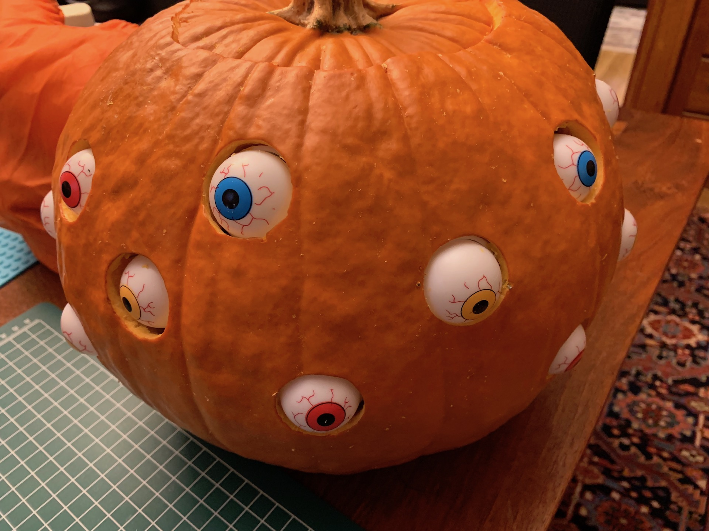
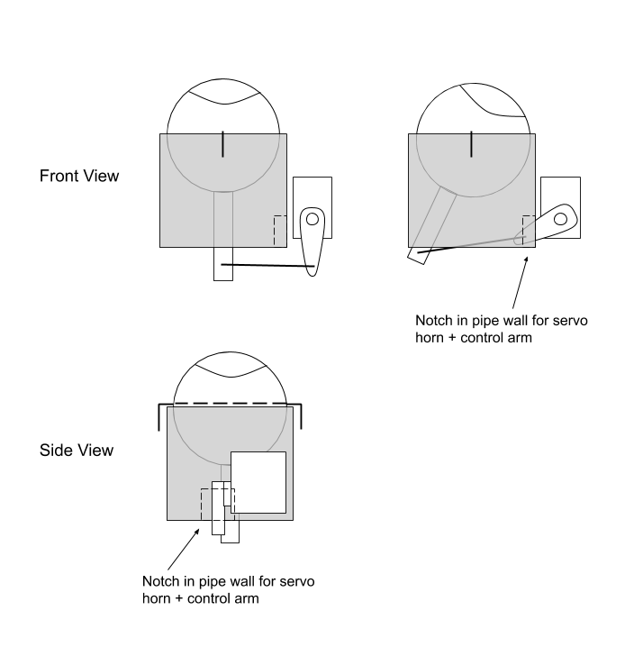
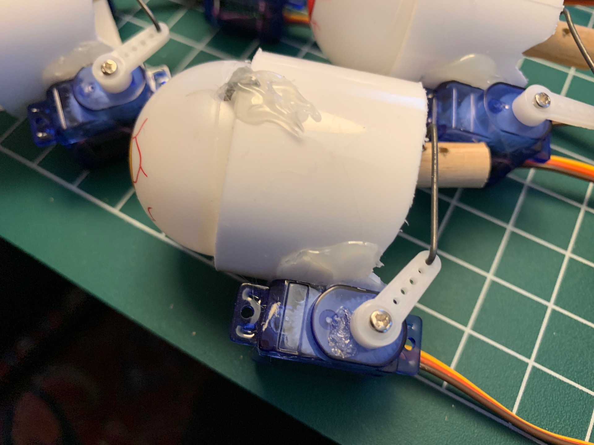
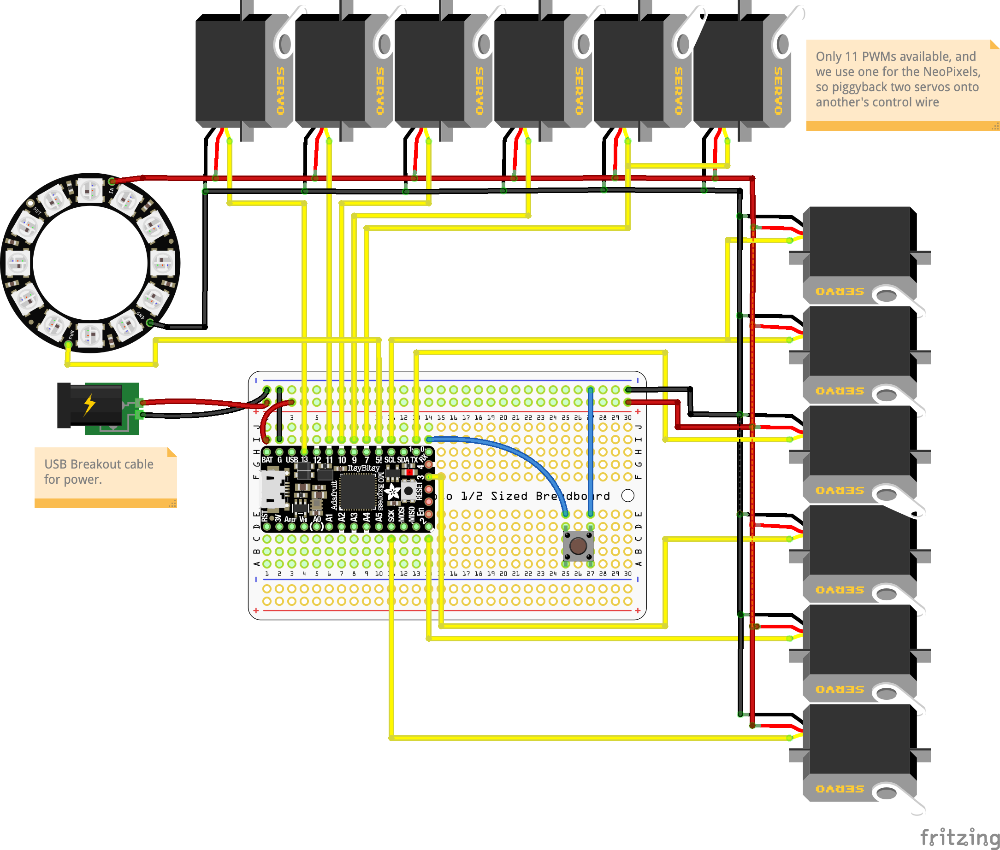
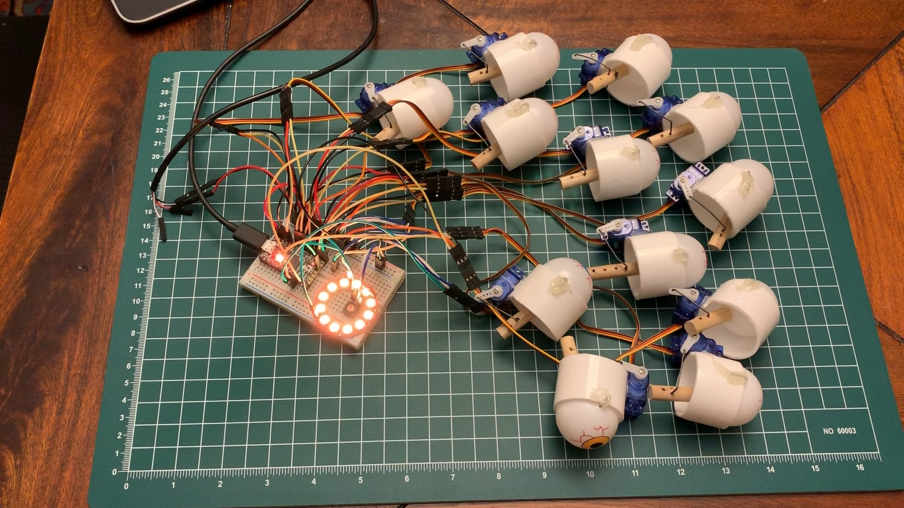
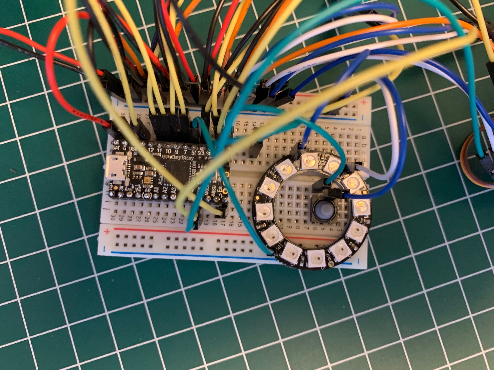

# pumpkin-eyes
CircuitPython-powered servo control for animatronic eyeballs, inspired by 68percentwater's [arduino servo pumpkin eyes](https://www.youtube.com/watch?v=ryUNHPJ3leY).

Built for Adafruit [ItsyBitsy Express M0](https://www.adafruit.com/product/3727).

## Parts list:
* 12x [SG51R Sub-Micro Servos](https://www.adafruit.com/product/2201)
* 1x [ItsyBitsy Express M0](https://www.adafruit.com/product/3727)
* 1x [Half-Size Breadboard](https://www.adafruit.com/product/64)
* 1x [Breadboarding wire bundle](https://www.adafruit.com/product/153)
* 1x [USB Type-A Breakout cable](https://www.adafruit.com/product/4448)
* 1x [NeoPixel Ring - 12x](https://www.adafruit.com/product/1643)
* 1x [Soft tactile button](https://www.adafruit.com/product/3101)
* 2x [1-1/2" sink drain extension tube](https://www.acehardware.com/departments/plumbing/sinks/sink-parts-and-repair/4224051)
* 1x [3-pack of 12 plastic eyeballs](https://www.amazon.com/gp/product/B07582HG6T/ref=ppx_yo_dt_b_asin_title_o03_s00?ie=UTF8&psc=1)
* 1x 5/16" wooden dowel
* Several paper clips, or other stiff wire (baling wire)
* 1x USB battery charger
* 1x large pumpkin (approx 12" diameter)

## Tools:
* Soldering iron
* Wire cutters
* Slip-joint pliers
* Needle-nose pliers
* Hot glue gun
* Fine-tooth razor saw
* File or sandpaper
* Drill with 1/16" and 5/64" bits and 1-3/8" hole saw
* Serrated knife

## Hints + Tips:

### Straightening a paper clip (or baling wire):
1. Pull the paper clip (or wire) mostly-straight by hand
1. If there are bends remaining in the wire, put each bend into the jaws of the pliers and squeeze shut to straighten the bend

### Forming the axles:
1. Straighten a paper clip or other stiff wire and cut a 2" length
1. Use the pliers to bend a short (1/4") 90-degree turn in the wire
1. Feed the other end of the wire through the eyeball (eew!)
1. Bend a 90-degree turn in the other end of the wire, which should now be in a 'U' shape. I found it best to grip the wire with needle-nose pliers just next to the eyeball, then use the slip joint pliers to create the 90-degree bend. Holding the wire with the needle-nose pliers prevents damaging the straight portion of the wire inside the eyeball
1. Use hot glue to affix the bend ends of the wire to the tube. Don't get any glue on the eyeballs!

### Assembling the eyeball mechanism
* Cut the tube into 1" lengths. A little shorter might be better; anything longer will limit the range of motion of the eye.
* The tube I selected happened to fit the eyeballs perfectly. Too perfectly, in fact! Each eyeball has a seam that runs around the middle of the ball. This seam was tall enough to bump into the edge of the tubing. I had to file down the seams on each eyeball to get smooth rotation.
* The eyeballs look better if they have a large range of motion. The range of motion is determined by the relative lengths of the servo horn and the location of the mounting hole in the dowel. To maximize range of motion, mount the control arm close to the base of the dowel. The dowels don't need to be long - 1" is fine.
* For better range of motion, the end of the servo horn should be level with the mounting hole in the dowel. However we also need the mounting hole to be realtively close to the base of the dowel. As a result the servo horn can impact the tube, interfering with range of motion. Cut a notch in the side of the tube to allow the servo horn to traverse freely.
* Use a 5/64" bit to drill the holes in the eyeball. This leaves a little bit of play for the ball to rotate in case the wire isn't perfectly straight.
* Use a 1/16" bit to drill the hole in the dowel for the control arm. This provides a tighter fit for the control arm, and gives better control. A 2" control arm is long enough.

### Notes on the circuit:
* The servos need 4.8v, and many microcontrollers want either 5v or 3.3v. Battery packs often put out 3v, 3.7v, or 6v. Rather than deal with voltage conversion and regulation, I opted for a 5v circuit powered by a USB battery charger. This simplified the wiring, allowing me to use a common 5v rail for both the servos and the microcontroller.
* The ItsyBitsy M0 Express can't power the servos and NeoPixels on its own. Instead, run the battery's power leads to the breadboard's buses. Power each device in parallel off the breadboard's bus.
* Since we're activating servos in batches, power consumption will be very spiky. It might be best to have a capacitor in between the power supply and the power bus, but I didn't look into this. The battery bank didn't seem to mind.
* Though the ItsyBitsy M0 Express is advertised to have 13 PWM outputs, I could only get 11 at one time. To control the 12th servo I piggybacked its control line onto that of another servo.
* The NeoPixels were a late addition. They require a 5v control signal, and have to be powered off the single 5v line (pin 5/D5). This meant piggybacking a second servo onto another's control line in order to free up D5.
* The button in the circuit pauses movement and resets the servos to their midpoint. This was useful to set up the servos for mounting. With the servo horn at the midpoint, I could be confident I was measuring and connecting the control arm properly. The pause button was also useful during debugging.

### Installation:
* A larger pumpkin is better; a smaller pumpkin will have much less space to maneuver. 12" diameter was good; 11" might work too.
* Use the hole saw to drill the eye holes. The 1-3/8" saw was perfect for my particular case.
* Enlarge the inside of each hole with a carving knife or similar; carve out some space for each servo, too.
* To get the eyeballs to stay in the pumpkin, I hot-glued a pair of 1" wires (from a paper clip) to each tube. These stuck into the flesh of the pumpkin and kept the eyeball assemblies in place. Mostly.
* I installed each eyeball assembly separately, then plugged them all in at the end. Use a bit of tape to hold keep each servo's wiring together.
* Cut a hole in the bottom rear of the pumpkin to run the USB power lead out to a battery. This keeps the battery outside and free of pumpkin goop.

## Notes for next time:
* The breadboard-and-jumper-wire setup is quite fragile; wires will pop out without much provocation. For reuse this needs a more-durable wiring harness.
* Carving the pumpkin takes longer than expected - set aside a couple hours.
* Find a better way to secure the eyeball mechanism to the inside of the pumpkin.
* Consider reducing the delay between eye movement to make it "twitchier"
* Try a whiter (less red) flame
* It's best viewed in daylight!
